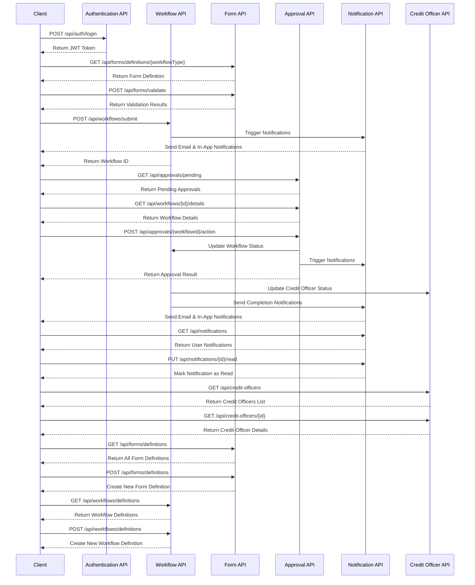

```mermaid
sequenceDiagram
    participant Client
    participant AuthAPI as Authentication API
    participant WorkflowAPI as Workflow API
    participant FormAPI as Form API
    participant ApprovalAPI as Approval API
    participant NotificationAPI as Notification API
    participant CreditOfficerAPI as Credit Officer API

    %% Authentication Flow
    Client->>AuthAPI: POST /api/auth/login
    AuthAPI-->>Client: Return JWT Token
    
    %% Workflow Initiation Process
    Client->>FormAPI: GET /api/forms/definitions/{workflowType}
    FormAPI-->>Client: Return Form Definition
    Client->>FormAPI: POST /api/forms/validate
    FormAPI-->>Client: Return Validation Results
    Client->>WorkflowAPI: POST /api/workflows/submit
    WorkflowAPI->>NotificationAPI: Trigger Notifications
    NotificationAPI-->>Client: Send Email & In-App Notifications
    WorkflowAPI-->>Client: Return Workflow ID
    
    %% Approval Process
    Client->>ApprovalAPI: GET /api/approvals/pending
    ApprovalAPI-->>Client: Return Pending Approvals
    Client->>ApprovalAPI: GET /api/workflows/{id}/details
    ApprovalAPI-->>Client: Return Workflow Details
    Client->>ApprovalAPI: POST /api/approvals/{workflowId}/action
    ApprovalAPI->>WorkflowAPI: Update Workflow Status
    ApprovalAPI->>NotificationAPI: Trigger Notifications
    ApprovalAPI-->>Client: Return Approval Result
    
    %% Workflow Completion
    WorkflowAPI->>CreditOfficerAPI: Update Credit Officer Status
    WorkflowAPI->>NotificationAPI: Send Completion Notifications
    NotificationAPI-->>Client: Send Email & In-App Notifications
    
    %% Notification Management
    Client->>NotificationAPI: GET /api/notifications
    NotificationAPI-->>Client: Return User Notifications
    Client->>NotificationAPI: PUT /api/notifications/{id}/read
    NotificationAPI-->>Client: Mark Notification as Read
    
    %% Credit Officer Management
    Client->>CreditOfficerAPI: GET /api/credit-officers
    CreditOfficerAPI-->>Client: Return Credit Officers List
    Client->>CreditOfficerAPI: GET /api/credit-officers/{id}
    CreditOfficerAPI-->>Client: Return Credit Officer Details
    
    %% Form Management
    Client->>FormAPI: GET /api/forms/definitions
    FormAPI-->>Client: Return All Form Definitions
    Client->>FormAPI: POST /api/forms/definitions
    FormAPI-->>Client: Create New Form Definition
    
    %% Workflow Definition Management
    Client->>WorkflowAPI: GET /api/workflows/definitions
    WorkflowAPI-->>Client: Return Workflow Definitions
    Client->>WorkflowAPI: POST /api/workflows/definitions
    WorkflowAPI-->>Client: Create New Workflow Definition
```
